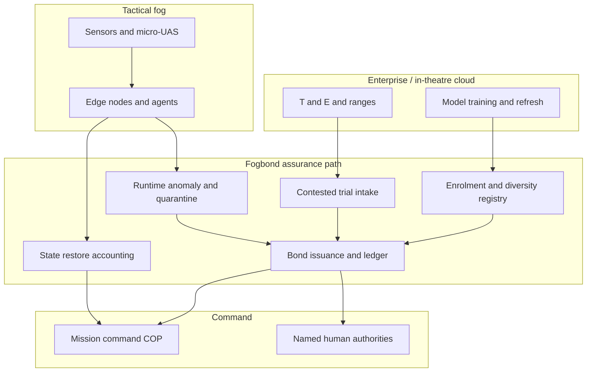

# Fogbond

**Source:** `ai-in-gov/The Future of Warfare-ai-at-the-edge/`
**Domain:** `ai-gov`
**One-liner:** An edge-autonomy assurance system that issues time-boxed operating bonds for AI agents on a tactical fog cloud — proving they can restore mission function under jamming, intermittent reachback and adversarial deception before a commander relies on them in a contested fight.
**Wedge:** U.S. and allied ground and joint tactical units fielding micro-UAS, edge sensors and autonomous software agents where reachback to enterprise cloud cannot be assumed once shooting starts — starting with platoon-to-brigade contested-comms exercises and Northern Edge–class events.
**Positioning:** Edge autonomy assurance, not another tactical cloud. Existing programmes provision compute and connectivity; Fogbond treats *permission to trust an edge agent when the network dies* as the product — a bond that expires when resilience evidence goes stale, and that forces diversity, quiet communications and human corrective authority into the operating picture.

## Market research synthesis

### Thesis from source

The source is a Hudson Institute panel transcript (30 May 2019) on gaining a tactical edge through cloud and AI, with Dr. Alexander Kott (Army Research Laboratory), Colonel Jeff Kojac (Joint Artificial Intelligence Center), Lindsey Sheppard (CSIS) and William Schneider, Jr. (Hudson / Defense Science Board). Its central claim is civilizational rather than incremental: artificially intelligent *beings* — numerous, ubiquitous, voracious producers and consumers of information, faster thinkers than humans — are invading the battlespace, and humans will gradually become a minority relative to machines on that field. The practical consequence for ground warfare is a reversal of sanctuary logic. Long-range intelligent munitions and cyber means make deep bases and reachback nodes more vulnerable than the dispersed edge; therefore “the edge is where cloud has to be located,” because connections to rear storage and processing “will not be reliable, will not be assured, will be subject to intercepts and manipulations, will be subject to jamming and elimination.”

Kott’s architectural answer is not a bigger central cloud but a *fog*: highly distributed droplets of data and compute on many small devices, continuously shuffling so that the adversary cannot catch and interpret the whole. “Small and many will be more important than big and few” because they are more survivable. Silence may beat loud long-haul links that invite artillery the moment they transmit. Security cannot be assured against malware that always finds a way in, so the decisive property becomes *resilience* — whether agents can restore what they are supposed to do and get back into action. Monoculture is framed as agricultural disaster: one malware wipes every identical device, so diversity of subspecies and living with multiplicity of standards becomes a requirement, not a defect. Command and control as traditionally understood is expected to fail against a multi-species force whose intentionality is partly incomprehensible to humans.

The panel repeatedly returns to the human and institutional conditions of that fog. Kojac names AI as a “fourth actor” in the Clausewitzian trinity and insists it must be handled “safe, secure, ethical, responsible” in ways that comport with society’s values. Sheppard argues that culture eats architecture: SOCOM’s call to “let the nerds get promoted” reveals that the organisation has not yet valued the skill sets it claims to need. Training is reframed as threefold — an ai-literate force, algorithms that must retrain at the edge (which requires cloud-scale data locally), and test-and-evaluation as continuous correction rather than a waterfall gate. An audience challenge on brittleness (snow backgrounds turning huskies into wolves; racist image recognition) is answered as a demand for human corrective authority without decision inertia. Kojac’s worked tactical vignette is the product’s moral wedge: a 23-year-old platoon commander whose micro-UAS, via tactical cloud and computer vision, identifies noncombatants around a corner and withholds fire. Schneider adds that submarine cable cutting will deny reachback early in a peer fight, so the edge must operate with the right sensor data and intelligent intermittent synchronisation — inferring what was missing after forty-five minutes of disconnect. Deception “by AI and for AI,” deposited in the cloud to poison thinking, is predicted to magnify.

The commercially and operationally defensible object is therefore not “deploy more models at the edge.” It is a bond: named agents, named resilience tests, named disconnect and deception scenarios, diversity constraints, and a recorded human authority path — issued before live trust, revoked when evidence goes stale.

### Buyer & economic model

- **Primary buyer:** programme executive and capability managers for tactical cloud / edge AI inside a service or joint AI office (JAIC-class), co-sponsored by the operational commander’s G-6 / J-6 and the test-and-evaluation authority.
- **Users:** edge software and autonomy engineers (daily), cyber and EW resilience analysts (daily during exercise and ops), platoon-to-brigade leaders and battle captains (mission planning and live use), exercise directors and range instrumentation staff (validation events), ethics and targeting advisors (rules-of-engagement and noncombatant-protection cases), acquisition and FFRDC/UARC evaluators (assurance evidence packs).
- **Budget owner / value metric:** the tactical cloud and autonomy programme line. The value metric is the share of fielded edge agents holding a current Fogbond with evidence fresher than the bond window, and the rate of successful mission-function restore after scripted disconnect, jam and deception injects. Secondary metrics are monoculture reduction (unique agent families per kill chain) and time from anomaly to human corrective action without decision paralysis.
- **Competing status quo:** enterprise cloud accreditation plus a cyber compliance checklist, algorithm T&E parked at FFRDCs/UARCs, and exercise play that historically stopped when cyber was introduced — leaving the commander with no portable proof that the *specific* agent on the *specific* fog node will still classify noncombatants correctly when reachback is gone.

### Domain constraints

- **Regulatory / trust / safety:** lethal and near-lethal autonomy sits under laws of armed conflict and national AI ethics policies; explainability for life-and-death classification cannot be deferred; deception and adversarial learning are first-class threats, not edge cases; export and classification rules constrain how assurance evidence travels across allies.
- **Data sensitivity:** tactical sensor feeds, model weights and bond evidence packs are highly classified or controlled; personal data of noncombatants must not leak into training or after-action exports; synthetic data used to reduce the “teraflops” burden must be labelled so it cannot silently poison live models.
- **Change-management realities:** services will not replace waterfall acquisition overnight; Fogbond must run beside existing ATOs and RMF packages. Culture change (valuing data and AI skills) is a named blocker. Agile prototype cycles with users are required for buy-in; monoculture standards lobbies will resist diversity requirements.

## Business requirements

- BR-1: No edge AI agent may be relied upon for a contested mission function unless it holds a current Fogbond covering that function, environment class and disconnect duration.
- BR-2: Every bond must encode a resilience profile — restore-to-function criteria after jam, malware, power loss and reachback loss — and fail closed if restore evidence is missing or expired.
- BR-3: Bonds must require agent-family diversity along each critical kill chain so that a single malware or adversarial pattern cannot wipe an entire monoculture of identical agents.
- BR-4: Quiet-communications and low-probability-of-intercept operating modes must be declarable and testable as bond conditions, not left as informal tactics.
- BR-5: Human corrective authority must be named for every autonomous or semi-autonomous classification that can affect use of force, with a recorded path that does not depend on enterprise reachback.
- BR-6: Adversarial and deception injects — including poisoned cloud deposits and sensor spoofing — must be part of the standard bond renewal battery, with outcomes itemised to the commander.
- BR-7: Intermittent synchronisation after disconnect must produce an explicit “state restore” record stating what was inferred versus what was received, suitable for after-action review.
- BR-8: Noncombatant-protection and collateral-risk classifications used in live vignettes must be auditable to the evidence that supported withhold-or-engage recommendations.
- BR-9: Bond evidence must be portable across joint and coalition partners under controlled release, without requiring a single centralised data lake.
- BR-10: Exercise and live-ops bonds must be distinguishable; a live bond cannot be issued solely on lab accuracy metrics without contested-environment trials.
- BR-11: The platform must report monoculture risk, bond coverage and restore success rates as command dashboards, not only as engineering metrics.
- BR-12: Revocation must be immediate when a quarantine threshold is crossed (e.g. adversarial failure rate, unexplained drift), and revocation itself must be an auditable event visible to the operational chain of command.

## User stories

Canonical user stories live in sibling [USER_STORIES.md](USER_STORIES.md).

## System design

### Overview

Fogbond sits between the tactical fog (edge devices, micro-UAS, local compute pods) and the enterprise/in-theatre clouds that train and periodically refresh agents. Before an agent is trusted for a named mission function, the system collects enrolment metadata, resilience profile, diversity constraints and human-authority mapping; runs or imports contested trial results; and issues a time-boxed bond. During operations it accepts health, anomaly and sync events from the fog, evaluates quarantine rules, and can revoke. After disconnect windows it records state-restore differentials. The bond ledger is the assurance system of record for commanders and T&E — separate from the serving path that runs inference on the device.

### Actors & boundaries

- **Actors:** edge agents (software), human commanders and maintainers, resilience engineers, T&E evaluators, ethics/targeting advisors, programme operators, coalition partners with release caveats.
- **Trust boundary:** bond evidence and revocation events are integrity-protected and readable by the operational chain; raw sensor PII and full model weights stay inside the classified tactical enclave; enterprise training clouds may push candidate models but cannot unilaterally mint a live bond.
- **Human-in-the-loop points:** initial bond approval for force-relevant functions; quarantine override; after-action adjudication of deception events; coalition release decisions.

### Core capabilities

1. **Agent enrolment and diversity registry** — families, versions, standards variance, kill-chain placement.
2. **Resilience profile management** — disconnect, jam, malware, power and quiet-comms conditions.
3. **Contested trial and T&E evidence intake** — lab versus exercise versus live distinction.
4. **Bond issuance and renewal** — time-boxed operating bonds per mission function.
5. **Runtime health, anomaly and deception signalling**.
6. **Quarantine and revocation**.
7. **Intermittent state-restore accounting**.
8. **Human authority and ROE mapping**.
9. **Command dashboards and audit export**.
10. **Controlled coalition evidence release**.

### Conceptual data

- **Primary entities:** AgentFamily, EdgeNode, ResilienceProfile, ContestedTrial, FogbondCertificate, MissionFunction, HumanAuthorityMap, AnomalyEvent, QuarantineOrder, StateRestoreRecord, DiversityScore, EvidencePack.
- **Critical events:** agent enrolled, trial completed, bond issued/renewed/revoked, jam/deception inject scored, disconnect window opened/closed, state restore posted, quarantine triggered.
- **Retention / audit needs:** bond and revocation history retained for the full operational and legal review window; raw video retained only under sensor-system policy; synthetic training provenance retained for model genealogy.

### Integrations (conceptual)

- **Systems of record:** tactical cloud orchestrators, device management, mission command COP, existing RMF/ATO repositories, range instrumentation.
- **Upstream signals:** EW/cyber threat feeds, model registries, exercise inject controllers, enterprise training pipelines.
- **Downstream actions:** agent allow/deny on edge nodes, commander alerts, T&E scorecards, acquisition evidence packs, coalition share packages.

### High-level architecture

### Success metrics

- **Leading:** percentage of fielded force-relevant agents with unexpired bonds; median time to revoke after quarantine trip; diversity score per kill chain; share of exercises that play cyber/EW to completion with scored bond outcomes.
- **Lagging:** restore-to-function success under contested injects; reduction in silent reliance incidents (agent used without bond); noncombatant-protection recommendation audit completion rate; coalition reuse of evidence packs without re-trial from scratch.

## OpenAPI skeleton

Canonical HTTP surface lives in sibling [openapi.yaml](openapi.yaml). Summary:

- **Base path:** `/v1/...`
- **Auth:** `X-API-Key` for edge/orchestrator integration; Bearer JWT for operators and evaluators.
- **Resource groups:** Agents, ResilienceProfiles, Trials, Bonds, Anomalies, StateRestores, Reporting.
