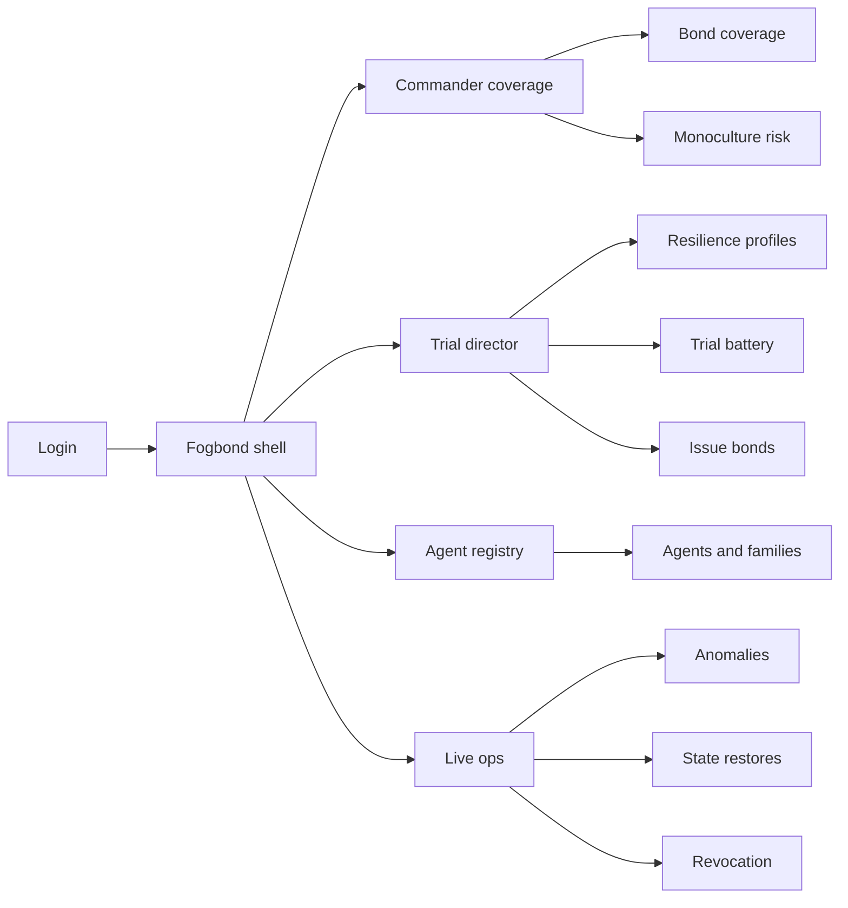
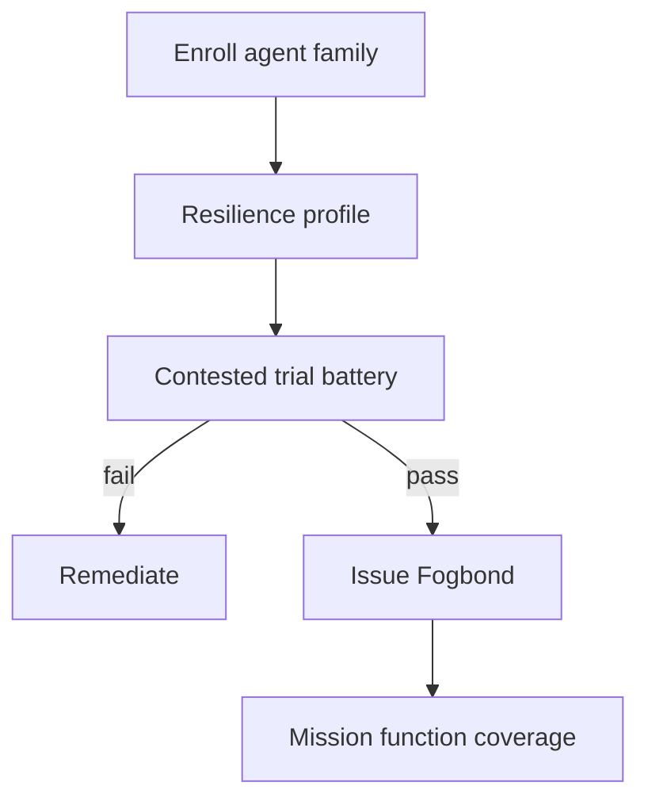
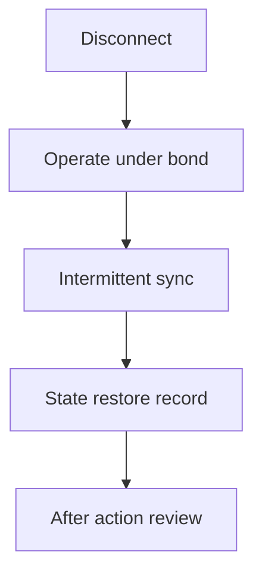

# Fogbond — Web app

**Product:** [PRODUCT.md](./PRODUCT.md)
**Primary surface:** Edge-autonomy assurance console (tactical S3/S6, test director, and higher-HQ oversight workspaces under one Fogbond shell)
**Secondary surfaces:** Portable bond evidence package (controlled release for joint/coalition); commander coverage dashboard (monoculture and restore rates)
**Design thesis:** Fogbond is a time-boxed operating bond for edge AI — not an MLOps accuracy dashboard and not an enterprise cloud ATO checklist. The metaphor is a fog-line bond certificate: an agent may be relied on for a contested function only while a current bond covers that function, environment class, and disconnect duration, with restore-to-function evidence after jam, malware, power loss, and reachback loss. Visual language is night-ops charcoal and chem-light green on muted OD, with flare amber for monoculture risk and blood-coral for revocation — never consumer “AI blue.” The Fogbond wordmark sits as a quiet stencil on every bond and revocation screen so the chain of command knows whose assurance they are trusting.

## UX research synthesis

### Category peers (best-in-class)

- **DoD RMF / eMASS-style authorization packages (process peer):** Evidence-bound authorizations with expiry. Steal: time-boxed authority to operate; reject enterprise-enclave assumptions that ignore contested disconnect.
- **UAV/robotics flight-test and airworthiness consoles:** Environment-class trials and fail-closed grounding. Steal: trial batteries before operational reliance; reject lab accuracy as sufficient for live bonds (BR-10).
- **Kubernetes/service mesh canary + quarantine UX (engineering peer):** Drift and anomaly quarantine with instant revoke. Steal: immediate revocation visibility; reject cloud-native chrome in tactical UI.
- **ATAK / tactical COP patterns:** Commander-readable coverage, not engineer dashboards. Steal: mission-function coverage boards; reject dense ML metric walls as the command home.

### Patterns to adopt / reject

- **Adopt:** Function × environment × disconnect-duration bonds; resilience profiles with restore evidence; agent-family diversity on kill chains; quiet-comms/LPI as testable conditions; named human corrective authority without reachback; adversarial/deception injects in renewal battery; state-restore inferred-vs-received records; auditable noncombatant classifications; portable evidence packs; exercise vs live bond distinction; monoculture/coverage/restore command dashboards; auditable immediate revocation.
- **Reject:** Accuracy-only green lights; permanent ATOs for edge agents; identical-agent monocultures; “phone home” human-in-the-loop as the only corrective path; purple AI; consumer drone app aesthetics.

### Trust, density, and workflow constraints from PRODUCT.md

Contested fight: reachback cannot be assumed (wedge). Fail closed without restore evidence (BR-2). Use-of-force classifications need named human corrective authority (BR-5). Coalition portability without a central lake (BR-9). Live bonds require contested trials (BR-10). Revocation visible to operational chain (BR-12).

## Information architecture

### Nav model

### Roles → default home

| Role | Default home | Why |
|------|--------------|-----|
| Tactical commander / S3 | Coverage dashboard | Rely only on bonded functions (BR-1, BR-11) |
| S6 / autonomy lead | Agent registry + monoculture | Diversity on kill chains (BR-3) |
| Trial / test director | Trial battery | Contested renewals (BR-6, BR-10) |
| Safety / legal advisor | Noncombatant audit + human authority | Use-of-force path (BR-5, BR-8) |
| Higher HQ / joint | Portable evidence packs | Controlled release (BR-9) |
| Watch officer | Anomalies and revocation | Immediate revoke (BR-12) |

### Cross-links to OpenAPI resources

| Nav area | OpenAPI tags / resources |
|----------|---------------------------|
| Agent registry / families | Agents |
| Resilience profiles | ResilienceProfiles |
| Contested trial battery | Trials |
| Operating bonds | Bonds |
| Quarantine / drift / adversarial | Anomalies |
| Post-disconnect state restore | StateRestores |
| Coverage / monoculture / restore rates | Reporting |

## Screen inventory

### Commander coverage home

- **Purpose:** Answer “for tonight’s mission functions, which agents hold current bonds — and where is monoculture risk?”
- **Entry:** Commander default.
- **Layout regions:** Brand stencil; mission-function matrix (bonded/unbonded); disconnect-duration coverage; monoculture amber; revoke alerts.
- **Primary actions:** Drill function; ground unbonded reliance; open revoke event.
- **Empty / loading / error:** Empty = no agents enrolled — block mission reliance messaging.
- **BR / story ties:** BR-1, BR-11.

### Agent and family registry

- **Purpose:** Register agents with family identity for diversity rules on kill chains.
- **Entry:** S6 home.
- **Layout regions:** Agent table; family tags; kill-chain assignments; diversity score.
- **Primary actions:** Enroll agent; assign family; flag monoculture.
- **Empty / loading / error:** Single-family critical chain = amber block on bond issue.
- **BR / story ties:** BR-3.

### Resilience profile editor

- **Purpose:** Encode restore-to-function criteria after jam, malware, power loss, reachback loss; quiet-comms/LPI conditions.
- **Entry:** Test director; before trials.
- **Layout regions:** Hazard checklist; restore criteria; LPI/quiet mode declarations; fail-closed rules.
- **Primary actions:** Save profile; attach to bond template.
- **Empty / loading / error:** Missing restore criterion blocks bond.
- **BR / story ties:** BR-2, BR-4.

### Trial battery console

- **Purpose:** Run contested-environment trials including adversarial/deception injects; itemise outcomes.
- **Entry:** Test home.
- **Layout regions:** Trial schedule; inject library (spoof, poison deposit, jam); outcome itemisation; exercise vs live eligibility.
- **Primary actions:** Start trial; record outcome; qualify for live bond.
- **Empty / loading / error:** Lab-only metrics cannot enable live bond issue.
- **BR / story ties:** BR-6, BR-10.

### Bond issue and status

- **Purpose:** Time-boxed bond for function × environment × disconnect duration; fail closed if evidence expired.
- **Entry:** After successful trials; commander drill.
- **Layout regions:** Bond certificate view; validity countdown; covered function; human corrective authority named; evidence links.
- **Primary actions:** Issue; renew; revoke; export portable pack.
- **Empty / loading / error:** Expired = chem-light extinguish, reliance blocked.
- **BR / story ties:** BR-1, BR-2, BR-5.

### Human corrective authority

- **Purpose:** Name path for classifications affecting use of force that does not depend on enterprise reachback.
- **Entry:** Bond detail; legal advisor.
- **Layout regions:** Authority roster; offline procedure; acknowledgement log.
- **Primary actions:** Assign; acknowledge; test offline path in trial.
- **Empty / loading / error:** Missing authority blocks bond for force-affecting functions.
- **BR / story ties:** BR-5.

### Noncombatant / collateral audit

- **Purpose:** Auditable evidence for withhold-or-engage recommendations in vignettes.
- **Entry:** Safety; after-action.
- **Layout regions:** Classification events; evidence trail; recommendation log.
- **Primary actions:** Attach evidence; export AAR slice.
- **Empty / loading / error:** Missing evidence flags bond review.
- **BR / story ties:** BR-8.

### State restore after disconnect

- **Purpose:** Explicit record of inferred vs received state after intermittent sync.
- **Entry:** Ops home post-disconnect; AAR.
- **Layout regions:** Timeline; inferred/received split; confidence; operator acknowledgement.
- **Primary actions:** Record restore; flag conflict; include in AAR.
- **Empty / loading / error:** Missing restore after disconnect = anomaly.
- **BR / story ties:** BR-7.

### Anomalies and revocation

- **Purpose:** Quarantine thresholds (adversarial fail rate, drift) trigger immediate auditable revoke visible to chain of command.
- **Entry:** Watch officer; alerts.
- **Layout regions:** Anomaly queue; threshold rules; revoke control; distribution list (operational CoC).
- **Primary actions:** Quarantine; revoke; reinstate only with new bond.
- **Empty / loading / error:** Empty = healthy coverage message.
- **BR / story ties:** BR-12.

### Portable evidence package

- **Purpose:** Controlled-release bond evidence for joint/coalition without central lake.
- **Entry:** Higher HQ; bond detail.
- **Layout regions:** Package contents; release classification; partner list; integrity hash.
- **Primary actions:** Build pack; release; revoke pack access.
- **Empty / loading / error:** Over-classification block with reason.
- **BR / story ties:** BR-9.

## Key flows

1. **Qualify and bond** — enroll agent → resilience profile → contested trial battery → issue time-boxed bond; failure: lab-only or monoculture block.

2. **Disconnect and restore** — lose reachback → operate under bond → sync → state restore inferred vs received → AAR.

3. **Adversarial revoke** — anomaly threshold → quarantine → revoke → CoC visible → re-trial for new bond.

4. **Coalition release** — build portable pack → controlled release → partner consume without lake.

5. **Force-affecting classification** — check named human authority offline path → allow bond or block.

## Design system

### Tokens (CSS variables)

- `--color-ink: #D8DED4` — text
- `--color-night: #0E1210` — ground
- `--color-panel: #171C18` — panels
- `--color-od: #3A4638` — chrome
- `--color-chemlight: #7CFF6B` — active bond (restrained, not neon flood)
- `--color-flare: #E6A23C` — monoculture / expiring
- `--color-blood: #C23B2E` — revocation
- `--color-steel: #8A9388` — secondary
- `--color-brand: #A8B59A` — Fogbond stencil
- `--font-display: "IBM Plex Sans", sans-serif` — condensed mission labels
- `--font-mono: "IBM Plex Mono", monospace` — bond ids, hashes, restore logs
- `--space-1`…`--space-8`: 4px scale
- `--radius-sm: 2px`; `--radius-md: 4px` — tactical sharp
- `--motion-bond: 150ms ease-out` — bond issue stamp
- `--motion-revoke: 200ms ease-in-out` — blood flash
- `--motion-countdown: 300ms linear` — validity tick emphasis
- Atmosphere: low-luminance; subtle scanline/noise; high contrast for night; no glossy sci-fi HUD clutter.

### Typography & brand

- Sans condensed for function names; mono for evidence.
- Stencil brand on bond certificate and revoke screens.
- Login: brand hero; headline (“No bond, no reliance”); one CTA — no sci-fi robot collage.

### Do / don’t

- **Do:** Time-box bonds; require contested trials for live; show monoculture; name offline human authority; itemise adversarial outcomes; make revoke visible.
- **Don’t:** Accuracy-only green; permanent ATOs; purple AI; cloud ATO metaphors; hide inferred state as received fact.

### Accessibility & domain trust cues

- Chem-light/flare/blood with text labels (bonded/expiring/revoked).
- Live regions for revoke and expiry.
- Focus: coverage → bond → trial → revoke.
- High contrast mode for tent/TOC lighting.

## Component patterns

- **MissionFunctionMatrix** — bonded coverage by function and disconnect duration.
- **BondCertificate** — time-boxed operating bond view.
- **ResilienceProfileForm** — jam/malware/power/reachback restore criteria.
- **TrialInjectBattery** — adversarial/deception outcomes.
- **FamilyDiversityMeter** — monoculture risk on kill chain.
- **HumanAuthorityCard** — offline corrective path.
- **StateRestoreSplit** — inferred vs received.
- **RevokeBanner** — CoC-visible revocation.
- **PortableEvidencePack** — controlled coalition release.
- **ExerciseLiveBadge** — bond class distinction.

## Out of scope for v1 web

- Flying the aircraft or controlling weapons; enterprise ML training pipelines; full C2 replacement (ATAK); SIGINT exploitation suites; public App Store client; simulating full EW range physics beyond recorded trial results.
